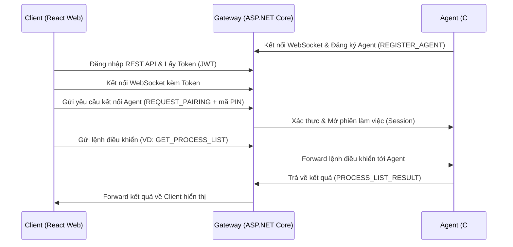

# Tổng quan Kiến trúc và Luồng Hoạt động (Project VIPPRO)

Tài liệu này sẽ giúp các bạn hiểu rõ bức tranh toàn cảnh của hệ thống: các thành phần nói chuyện với nhau như thế nào, và luồng chạy thực tế của một tính năng từ lúc người dùng bấm nút đến lúc có kết quả.

## Mục lục
1. [Tổng quan kiến trúc (Architecture Overview)](#1-tong-quan-kien-truc)
2. [Giao thức giao tiếp](#2-giao-thuc-giao-tiep)
3. [Luồng hoạt động cụ thể (Use cases)](#3-luong-hoat-dong-cu-the)

---

## 1. Tổng quan kiến trúc (Architecture Overview)

Dự án này gồm 3 thành phần chính:
- **Client (React)**: Giao diện web cho người điều khiển (Operator).
- **Gateway (ASP.NET Core)**: Máy chủ trung gian đứng giữa làm nhiệm vụ xác thực và định tuyến tin nhắn.
- **Agent (C#)**: Phần mềm chạy ngầm trên máy bị điều khiển (Windows/macOS) thực thi các lệnh như chụp màn hình, xem tiến trình.

### Sơ đồ luồng dữ liệu

### Giải thích bằng ví dụ đời thực
Hãy tưởng tượng hệ thống này như một **Tổng đài điện thoại**:
- **Agent (Máy bị điều khiển)**: Giống như một chuyên viên sửa ống nước, lúc nào cũng bật bộ đàm và báo cáo với Tổng đài: "Tôi đang rảnh, mã số của tôi là 123".
- **Client (Trình duyệt web của bạn)**: Là bạn, người đang cần sửa ống nước.
- **Gateway (Máy chủ ASP.NET Core)**: Là cô nhân viên Tổng đài ở giữa.

**Tại sao cần Gateway ở giữa? Tại sao Client không gọi trực tiếp Agent?**
1. **Vấn đề địa chỉ IP (NAT/Firewall)**: Máy Agent thường ở trong mạng nội bộ, hoặc bị tường lửa chặn, không có IP công khai. Bạn không thể "gọi trực tiếp" cho họ. Nhưng cả bạn và Agent đều có thể gọi lên Gateway (vì Gateway đặt trên mạng có IP tĩnh/công khai).
2. **Bảo mật**: Gateway đứng ra kiểm tra xem bạn có quyền điều khiển Agent đó không (hỏi mã PIN, kiểm tra đăng nhập). Nếu không có Gateway, bất kỳ ai dò ra IP của Agent đều có thể vào phá máy.
3. **Lưu vết (Audit Log)**: Gateway giúp ghi lại toàn bộ lịch sử (ai đã kết nối với ai, lúc mấy giờ) vào database.

## 2. Giao thức giao tiếp

Trong dự án này, chúng ta sử dụng **hai giao thức** chính:

1. **HTTP REST API**: Được dùng ở Client cho các tác vụ một chiều, ngắn hạn như:
   - Đăng nhập (gửi username/password lấy token).
   - Đăng ký tài khoản.
   *(Nó giống như gửi một bức thư: bạn gửi đi, người ta xử lý rồi gửi thư phản hồi, xong là cắt đứt liên lạc).*

2. **WebSockets (RAW WebSockets, KHÔNG DÙNG SignalR)**: Được dùng cho TOÀN BỘ quá trình điều khiển thời gian thực.
   - Cả Client và Agent đều mở một kết nối WebSocket vĩnh viễn tới Gateway (`/ws`).
   - Mọi lệnh (chuột, phím, tiến trình, màn hình) đều được đóng gói thành các chuỗi JSON và bắn qua ống nước WebSocket này.
   *(Nó giống như một cuộc gọi điện thoại trực tiếp: kết nối mở liên tục, bạn nói, tôi nghe ngay lập tức mà không cần bấm số gọi lại từ đầu).*

---

## 3. Luồng hoạt động cụ thể (Walkthrough theo Use Case)

Dưới đây là chi tiết từng bước (code chạy thế nào) cho 2 chức năng quan trọng nhất.

### Tình huống 1: Agent khởi động và Client ghép cặp (Pairing)

**Bước 1: Agent khởi động**
- Trong file `Agent/Program.cs`, Agent khởi tạo các dịch vụ.
- `GatewayConnection.cs` (của Agent) mở kết nối WebSocket tới Gateway.
- Agent bắn một tin nhắn `REGISTER_AGENT` chứa `AgentSecretKey` lên Gateway.
- Gateway (file `MessageRouter.cs`, hàm `RegisterAsync`) xác thực khóa này, nếu đúng thì đánh dấu Agent là "Online".

**Bước 2: Client yêu cầu điều khiển (Ghép cặp)**
- Người dùng trên web nhập mã PIN của Agent và bấm nút kết nối.
- Client React (`wsClient.ts`) gọi hàm `send()` gửi tin nhắn JSON `REQUEST_PAIRING` kèm mã PIN qua WebSocket.
- Gateway (`MessageRouter.cs`, hàm `PairAsync`):
  - Nhận tin, kiểm tra xem mã PIN có đúng với database không (dùng `IPairingService`).
  - Nếu đúng, tạo một `SessionBinding` (Phiên làm việc), ghép cặp `connectionId` của Client với `connectionId` của Agent.
  - Bắn thông báo `PAIRING_RESULT` (Success=true) về lại Client.

### Tình huống 2: Lấy danh sách tiến trình (Process List)

**Bước 1: Người dùng thao tác**
- Người dùng bấm nút "Xem tiến trình" trên giao diện React.
- React gọi `wsClient.send('GET_PROCESS_LIST', ...)` để gửi một gói tin JSON qua WebSocket lên Gateway.

**Bước 2: Gateway định tuyến (Routing)**
- Gateway (`MessageRouter.cs`) nhận được chuỗi JSON.
- Gateway thấy action là `GET_PROCESS_LIST`. Nó nhìn vào từ điển `ToAgent` (chứa danh sách các lệnh dành cho Agent) và xác nhận đây là lệnh gửi cho máy bị điều khiển.
- Căn cứ vào `SessionId`, Gateway tìm ra đường ống WebSocket đang nối với Agent đó, và **chuyển tiếp nguyên xi (Forward)** chuỗi JSON xuống Agent. (Hàm `connections.SendAsync(targetId, rawJson)`).

**Bước 3: Agent xử lý**
- C# Agent (`GatewayConnection.cs`) nhận tin nhắn JSON từ Gateway, chuyển nó cho `AgentProcessor.cs` hoặc `AgentCommandDispatcher`.
- Agent tìm hàm xử lý lệnh `GET_PROCESS_LIST` (có thể gọi hàm API của hệ điều hành Windows/macOS để liệt kê Task Manager).
- Đóng gói danh sách tiến trình thành JSON, gắn tên action là `PROCESS_LIST_RESULT` và bắn ngược lại Gateway.

**Bước 4: Gateway chuyển lại cho Client**
- Gateway nhận `PROCESS_LIST_RESULT`, lại thấy đây là tin nhắn thuộc nhóm `ToBrowser` (gửi cho người dùng).
- Gateway dò `SessionId` tìm ra đường ống của Client React và Forward trả lại.

**Bước 5: Client hiển thị**
- `wsClient.ts` trong React nhận JSON, kích hoạt các Listener.
- Component của React tự động cập nhật State (`setState`), vẽ ra bảng danh sách tiến trình lên màn hình người dùng.
