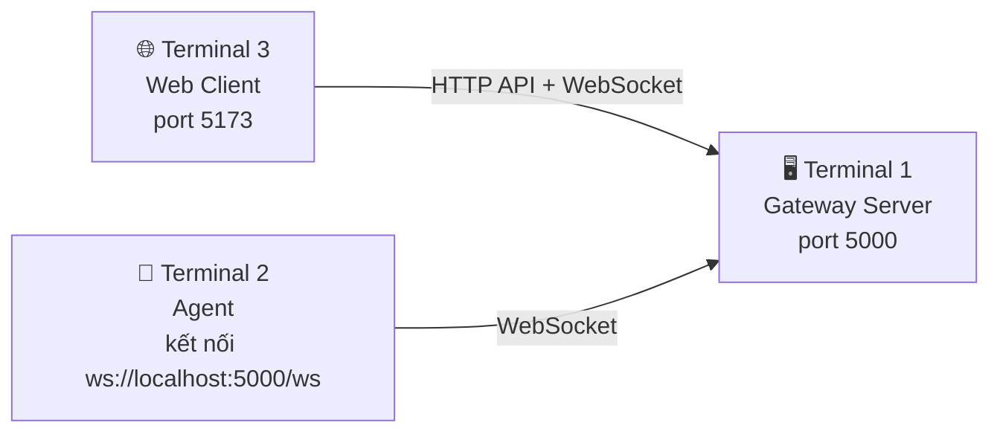

# 🚀 Hướng Dẫn Chạy E2E Test — 3 Terminal

> Chạy cả 3 thành phần (Gateway, Agent, WebClient) trên cùng máy Mac để test end-to-end.

---

## Sơ Đồ Tổng Quan



---

## Bước 1: Mở 3 Terminal

Trong macOS Terminal, bấm **⌘ + T** để mở tab mới, hoặc **⌘ + N** cho cửa sổ mới. Bạn cần 3 terminal:

| Terminal | Dùng cho | Thư mục |
|----------|----------|---------|
| Terminal 1 | Gateway Server | `src/Gateway` |
| Terminal 2 | Agent | `src/Agent` |
| Terminal 3 | Web Client | `src/WebClient` |

---

## Bước 2: Terminal 1 — Khởi Động Gateway

```bash
cd "/Users/phamgiahung/Downloads/ĐỒ ÁN MÔN HỌC/MẠNG MÁY TÍNH/PROJECT VIPPRO/src/Gateway"
dotnet run
```

> [!NOTE]
> Gateway sẽ tự tạo database SQLite (`remotecontrol.db`) và chạy migration khi khởi động.
> Mặc định chạy tại **http://localhost:5000**

**Kiểm tra Gateway hoạt động** (mở terminal khác):
```bash
curl http://localhost:5000/health
```
Kết quả mong đợi: `{"status":"ok"}`

---

## Bước 3: Đăng Ký Tài Khoản + Tạo Agent (chỉ cần làm 1 lần)

### 3a. Đăng ký tài khoản Operator

```bash
curl -X POST http://localhost:5000/api/auth/register \
  -H "Content-Type: application/json" \
  -d '{"username":"admin","password":"Admin@123456"}'
```

### 3b. Đăng nhập lấy JWT token

```bash
curl -X POST http://localhost:5000/api/auth/login \
  -H "Content-Type: application/json" \
  -d '{"username":"admin","password":"Admin@123456"}'
```

> [!IMPORTANT]
> Copy giá trị `token` từ response — bạn sẽ cần nó cho bước tiếp theo.

### 3c. Tạo Agent (Provision)

Thay `<JWT_TOKEN>` bằng token vừa copy:

```bash
curl -X POST http://localhost:5000/api/agents \
  -H "Content-Type: application/json" \
  -H "Authorization: Bearer <JWT_TOKEN>" \
  -d '{"agentName":"MacBook-Test","platform":"MacOS"}'
```

Response sẽ trả về:
```json
{
  "agentId": "xxxxxxxx-xxxx-xxxx-xxxx-xxxxxxxxxxxx",
  "agentSecretKey": "some-secret-key-string",
  "agentName": "MacBook-Test"
}
```

> [!IMPORTANT]
> Copy **agentId** và **agentSecretKey** — bạn cần dán vào file cấu hình Agent.

### 3d. Cập nhật cấu hình Agent

Mở file `src/Agent/appsettings.json` và thay thế:

```json
{
  "Agent": {
    "GatewayUrl": "ws://localhost:5000/ws",
    "AgentId": "<DÁN agentId VÀO ĐÂY>",
    "AgentSecretKey": "<DÁN agentSecretKey VÀO ĐÂY>",
    "AllowPowerCommands": false,
    "AdditionalBlockedPaths": [],
    "AdditionalProtectedProcesses": []
  }
}
```

---

## Bước 4: Terminal 2 — Khởi Động Agent

```bash
cd "/Users/phamgiahung/Downloads/ĐỒ ÁN MÔN HỌC/MẠNG MÁY TÍNH/PROJECT VIPPRO/src/Agent"
dotnet run
```

> [!NOTE]
> Agent sẽ:
> 1. Kết nối WebSocket tới Gateway (`ws://localhost:5000/ws`)
> 2. Gửi `REGISTER_AGENT` message
> 3. Nhận `REGISTER_AGENT_RESULT`
> 4. Sinh mã PIN 6 số và hiển thị trên console/notification
>
> **Ghi lại mã PIN** — bạn cần nhập trên Web Client để ghép cặp!

---

## Bước 5: Terminal 3 — Khởi Động Web Client

```bash
cd "/Users/phamgiahung/Downloads/ĐỒ ÁN MÔN HỌC/MẠNG MÁY TÍNH/PROJECT VIPPRO/src/WebClient"
npm run dev
```

Mở trình duyệt tại: **http://localhost:5173**

---

## Bước 6: Test Trên Trình Duyệt

### 6a. Đăng nhập
- Username: `admin`
- Password: `Admin@123456`

### 6b. Ghép cặp (Pairing)
- Chọn Agent từ danh sách (hoặc nhập AgentId)
- Nhập **mã PIN 6 số** hiển thị ở Terminal 2 (Agent)
- Bấm Ghép cặp → Session được tạo

### 6c. Test các chức năng
Sau khi pairing thành công, thử từng chức năng:

| Chức năng | Cách test | Quan sát |
|-----------|-----------|----------|
| **List Process** | Bấm tab Processes | Bảng tiến trình hiển thị |
| **Start Process** | Chọn app → Start | App mở trên Mac |
| **Stop Process** | Chọn process → Stop | Process bị kill |
| **Screen View** | Bấm tab Screen | Stream ảnh màn hình |
| **Webcam** | Bấm tab Webcam | Stream webcam (cần cấp quyền) |
| **File Browser** | Bấm tab Files | Duyệt thư mục |
| **Keylogger** | Bấm Enable Keylogger | Popup xin phép trên Agent |

---

## Xử Lý Lỗi Thường Gặp

| Lỗi | Nguyên nhân | Giải pháp |
|-----|-------------|-----------|
| `Connection refused` khi Agent kết nối | Gateway chưa chạy | Đảm bảo Terminal 1 (Gateway) chạy trước |
| `CORS error` trên browser | Port không khớp | Kiểm tra `.env.local` và `appsettings.json` đều dùng port 5000 |
| Webcam không hoạt động | Chưa cấp quyền Camera | macOS sẽ hỏi → bấm Allow |
| Screen capture đen | Chưa cấp quyền Screen Recording | System Preferences → Privacy → Screen Recording → cho phép terminal/agent |
| Agent không nhận lệnh | Chưa pairing | Nhập đúng PIN 6 số từ Agent console |

---

## Thứ Tự Tắt

Tắt theo thứ tự ngược:
1. **Terminal 3**: `Ctrl+C` (Web Client)
2. **Terminal 2**: `Ctrl+C` (Agent)
3. **Terminal 1**: `Ctrl+C` (Gateway)
